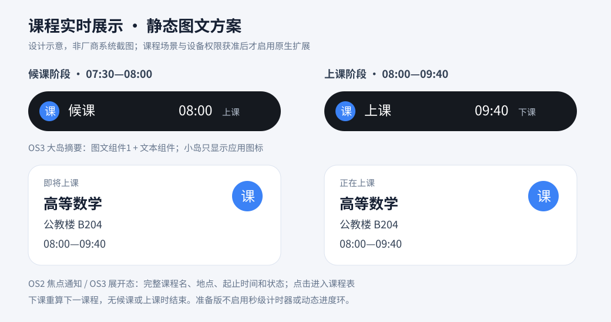

# 课程表原生灵动岛接入准备与审核材料

核对日期：2026-10-05。包名：`com.chen.schedule`。最低 Android 8.0（API 26）；本版沿用 compileSdk/targetSdk 34，设备验证范围以验证报告为准。

本材料用于申请和后续联调。应用目前没有任何厂商课程场景的批准凭证；交付包默认使用普通课程通知。原生参数被构建、普通通知显示、模拟器预览和兼容悬浮窗都不能作为厂商“上岛成功”证据。

## 当前支持状态

| 厂商／设备 | 本版实现 | 当前原生状态 | 获批后仍须完成 |
| --- | --- | --- | --- |
| 小米 HyperOS 2 | 查询焦点协议、焦点权限；准备静态图文焦点通知载荷 | 待审批／配置，普通课程通知 | 候课／上课场景审核、OS2 测试资格、鉴权配置、真机联调 |
| 小米 HyperOS 3 | 以上能力加设备岛能力检查及静态大岛／小岛载荷 | 待审批／配置，普通课程通知 | 场景审核、设备资格、鉴权配置、正式签名包真机验证 |
| OPPO／一加 | 隔离适配接口；申请与配置清单 | 流体云待接入，普通课程通知 | 获取本地 SDK、授权码、服务和事件协议；核实离线使用范围 |
| 荣耀 | 隔离适配接口；Suggestions Kit 全局触达申请清单 | 待接入，普通课程通知 | 场景、接口、权限和测试资格确认；获批后接入 SDK |
| vivo／iQOO | 厂商识别与明确待接入状态 | 本地 Android 原生接口待确认，普通课程通知 | 取得可核实的官方接入文档、资格和本地数据使用方案 |
| 兼容 Android 的华为 | 厂商识别与明确待接入状态 | 本地实况窗接口待确认，普通课程通知 | 确认 Android 设备接口与资格；不使用 HarmonyOS NEXT 接口冒充 Android 支持 |
| 其他 Android | 普通课程通知 | 普通通知 | 无原生厂商接口 |

普通通知仍取决于用户授予通知权限并开启实时展示通道。自绘兼容悬浮只由用户主动选择；它不代表任何厂商原生能力。

## 可直接复用的场景说明

应用为学生提供个人课程表。课程、作息和学期信息保存在本机，实时展示仅处理当天实际教学周生效的课程。学生主动开启后，在上课前有限候课窗口展示下一门课，在课程开始时切换为正在上课，在下课时结束或交接下一门课。主要信息为课程名、教室、起止时间和课程状态，点击通知进入课程表。

申请两个独立场景：“即将上课”和“正在上课”。候课展示默认提前 30 分钟，可由用户调整；声音提醒为独立能力，保留默认提前 20 分钟，不与实时展示强绑定。无当天课程、学期范围外、未进入候课窗口或全部课程结束时不保留实时卡片。

本次不增加服务器、云推送、运营消息或课程数据上传。SDK 若要求远程事件或不支持本地调度，应先重新核实可行性，不改变本版本地运行约束。

### 展示节点与设计示意

以高等数学、公教楼 B204、08:00–09:40 为例。示意图是设计材料，不是实际厂商 UI 截图。

| 节点 | 触发 | 卡片主要内容 | 生命周期 |
| --- | --- | --- | --- |
| 无实时课程 | 当天无课／候课窗口外 | 无实时卡片 | 撤销通知 `8888` |
| 候课开始 | 07:30 进入默认 30 分钟窗口 | 即将上课 · 高等数学；公教楼 B204；08:00–09:40 | 08:00 前有效 |
| 上课开始 | 08:00 课程边界 | 正在上课 · 高等数学；公教楼 B204；08:00–09:40 | 09:40 前有效 |
| 上课结束 | 09:40 课程边界 | 重算当前状态；有下一门候课则更新为下一课 | 无候课／上课即撤销 |
| 课程资料修改 | 编辑课程／作息／学期 | 按最新本地信息重算 | 不沿用旧广播携带的课程文本 |
| 授权变化／重启 | 返回应用、系统事件 | 重查权限和状态，重排当天边界 | 失去原生资格时普通通知降级 |

小米焦点展开态选用官方模板库中“文本组件2＋识别图形组件1”（`baseInfo.type=2`、`picInfo.type=1`）。OS3 摘要选用“图文组件1＋文本组件”：左侧应用图标＋“候课／上课”，右侧静态“08:00 上课／09:40 下课”；小岛为应用图标。完整课程信息保留在展开态。未使用计时器、秒级倒计时、动态进度条、自动进度环或分享课程数据功能。

## 小米接入实现与获批后配置

入口为 `IslandNativeAdapters.capability(Context)` 和 `decorate(Context, Notification.Builder, IslandState)`，均在 IO 线程调用。适配器不拥有通知 ID 或通知调度，创建、更新和结束统一由实时展示协调器执行。`nativeAvailable=true` 只表示满足发送条件，没有系统展示回执。

按官方客户端方式写入 `miui.focus.param` 字符串和 `miui.focus.pics` 图标 Bundle。ROM 能力值从 `Settings.System` 的 `notification_focus_protocol` 读取；仅处理已核对的 2／3，未知版本降级。OS3 还检查 `persist.sys.feature.island`；焦点权限通过公开通知 Provider 的 `canShowFocus` 查询，查询异常降级。权限查询禁止在主线程执行。

**本版不含以下批准配置。** 获批后在对应构建类型的 Manifest 中填写，不能让普通用户通过设置伪造审批。`business` 必须采用平台确认的课程场景标识，不能照抄其他行业示例。

| Manifest meta-data | 取值／来源 |
| --- | --- |
| `com.xiaomi.xms.APP_ID` | 小米服务启用后提供的真实 App ID |
| `com.xiaomi.xms.BUILD_TYPE_DEBUG` | Debug 包为 `true`，正式签名包为 `false`，必须与当前构建类型一致 |
| `course_schedule.island.xiaomi.upcoming.approved` | 候课场景获准才为 `true`，默认 `false` |
| `course_schedule.island.xiaomi.upcoming.business` | 候课场景获准业务标识 |
| `course_schedule.island.xiaomi.upcoming.protocols` | 该场景获准并联调通过的 ROM 协议：`"2"`、`"3"` 或 `"2,3"` |
| `course_schedule.island.xiaomi.ongoing.approved` | 上课场景获准才为 `true`，默认 `false` |
| `course_schedule.island.xiaomi.ongoing.business` | 上课场景获准业务标识 |
| `course_schedule.island.xiaomi.ongoing.protocols` | 该场景获准并联调通过的 ROM 协议 |

只通过一个场景的审核不会启用另一个场景。只通过 OS2 联调不会启用 OS3。缺 App ID、构建鉴权环境不匹配、场景标识空白、未批准、焦点权限关闭／查询失败或不支持设备均发送普通通知；`filterWhenNoPermission=false` 保证厂商侧也按普通通知降级。

普通课程通知中的起止时间为静态文字。载荷自动超时设置到当前课程阶段的真实边界，课程交接仍由协调器重新计算。系统未授予精确闹钟权限、设备处于省电模式或系统限制后台时可能延迟，不承诺一分钟内展示。

## 其他厂商接入清单

适配隔离点为 `NativeCourseNotificationAdapter`，提供资格检查和通知修饰两项能力；本版的待接入实现不引入未知 SDK、不调用缺配置服务。若未来厂商采用独立 SDK 创建／更新／结束事件，仍由统一协调器保留唯一生命周期所有权，不能另建通知调度链。

| 厂商 | 应向厂商确认并取得的材料 |
| --- | --- |
| OPPO／一加 | 应用身份、课程场景批准、授权码／获取方式、SDK 版本、服务 ID 和事件协议、支持机型／ColorOS／一加系统版本、纯本地创建／更新／结束接口、离线限制、测试授权与证书要求 |
| 荣耀 | Suggestions Kit 全局触达场景是否接受个人课程、申请权限、服务标识、SDK 和本地接口、测试名单／账号、应用签名与发布验证要求 |
| vivo | 官方本地 Android 接口与文档、场景审批、设备系统范围、纯本地生命周期、授权与签名要求 |
| 华为 Android | Android 设备的本地实况窗能力是否存在及公开范围、场景／服务资格、SDK、系统和机型范围、离线生命周期、签名及验证要求 |

官方文档入口：

- [小米开发指南](https://dev.mi.com/xiaomihyperos/documentation/detail?pId=2131)（页面中的 2026-01-29 模板库 PDF 用于本版静态字段核对；字段表页 31、39、95、104–105）。
- [小米接入流程](https://dev.mi.com/xiaomihyperos/documentation/detail?pId=2132)（客户端本地方案、场景审批、App ID、测试／正式鉴权流程）。
- [OPPO 流体云接入指南](https://open.oppomobile.com/documentation/page/info?id=12719)（动态页面；最终授权和事件协议以申请账户取得的官方材料为准）。
- [荣耀全局触达配置指南](https://developer.honor.com/cn/doc/guides/101455)（动态页面；最终课程资格和配置以平台答复为准）。
- [Android 闹钟调度限制](https://developer.android.com/develop/background-work/services/alarms)。

vivo／华为 Android 本版未确认可用的公开本地接口，申请材料不得写为已支持。

## 应用与签名信息清单

| 项目 | 本版事实／待补项 |
| --- | --- |
| 应用名称 | 课程表（与申请平台登记名称再核对） |
| 包名 | `com.chen.schedule` |
| APK | 正式发布版本 v1.3.6／versionCode 55；Debug 准备包用于前期功能验证 |
| Debug 证书 SHA-256 | `2f398d73f24f003d93a03a8e8f6b28c3b49458fcb101ad7fe86151768d116c85`（本次交付包；Android Debug 证书） |
| 前期 Debug APK SHA-256 | `84aa26fc00800b5753a90670323dbf1a318d4cc4d142d206f3edc40f22c63fbd` |
| 正式证书 SHA-256 | `4f106f2892ab58261aef90f780a235956eba02165dc8c2b46641e39b9b26a54c`；发布时与官方旧版本核对，新包结果见发布验证报告 |
| 小米 App ID | 未提供，待服务启用后填写 |
| 厂商联系人／账号 | 未提供，由应用所有者填写 |
| 候课／上课业务标识 | 未提供，分别以获批结果为准 |
| 系统版本／设备标识 | 真机测试时记录；测试白名单信息只在厂商要求的渠道提交 |
| 隐私说明 | 实时课程状态在本机计算，本次不新增云服务或课程数据上传 |

不要在材料中放入私钥、签名密码或本机配置文件。正式申请应包含已审核方案、正式签名 APK 和可复现验证步骤；应用版本发布不代表获得厂商资格，本次未代用户提交厂商材料或发送邮件。

## 真机验收表

“未验证”不是通过。当前厂商原生项目全部待资格与真机验证；下表由后续测试负责人填入设备、系统版本、APK SHA-256、签名指纹、截图／录像和结果。

| 验收场景 | 预期 | 设备／系统／证据 | 当前结果 |
| --- | --- | --- | --- |
| 默认新安装 | 实时展示关闭；不开悬浮服务 | 待填 | 待验证 |
| 未获批／无 App ID | 普通通知；设置说明待接入 | 待填 | 待真机验证 |
| 小米 OS2 已授权且对应场景获批 | 焦点通知；无 OS3 岛摘要 | 待填 | 待资格与真机 |
| 小米 OS3 已授权且对应场景获批 | 静态大岛／小岛及展开课程信息 | 待填 | 待资格与真机 |
| 只批准候课 | 候课可用；上课时普通通知 | 待填 | 待资格与真机 |
| 只批准 OS2 | OS3 保持普通通知 | 待填 | 待资格与真机 |
| 焦点权限关闭／Provider 查询失败 | 普通课程通知；不隐藏通知 | 待填 | 待真机验证 |
| 系统通知权限拒绝 | 不显示课程通知，应用说明权限状态 | 待填 | 待验证 |
| 仅实时展示通道关闭 | 无实时通知，独立声音提醒按用户设置工作 | 待填 | 待验证 |
| 仅声音提醒通道关闭 | 实时课程通知按用户设置工作 | 待填 | 待验证 |
| 声音开关关闭、实时展示开启 | 静默展示课程，未擅自开启声音 | 待填 | 待验证 |
| 候课→上课→下课 | 同一通知 `8888` 更新；无实时状态即撤销 | 待填 | 待验证 |
| 连续课程与延迟旧结束广播 | 保留最新课程，不被旧事件清除 | 待填 | 待验证 |
| 编辑课程／时间／学期，浏览其他教学周 | 展示以实际教学周最新数据为准 | 待填 | 待验证 |
| 重启／升级／系统时间与时区变更 | 重新计算、重排当天事件 | 待填 | 待验证 |
| 精确闹钟关闭／省电限制 | 显示可能延迟；不承诺固定到达时限 | 待填 | 待验证 |
| 系统模式↔兼容悬浮 | 只启动选定模式；悬浮需独立授权 | 待填 | 待验证 |
| 临时模拟预览结束 | 恢复真实状态与原有展示开关 | 待填 | 待验证 |
| 断网验证本地运行 | 课程状态正常计算与普通通知展示 | 待填 | 待验证 |
| 其他厂商当前版本 | 清楚标记待接入并显示普通通知 | 待填 | 待真机验证 |

自动化已包含厂商识别、默认未审批、阶段审批隔离、协议隔离、权限失败、鉴权环境不匹配、JSON 转义、图文模板字段、超时边界和无课撤销载荷测试。总体构建与模拟器结果以本次验证报告为准，不把单元测试替代厂商原生真机验收。
